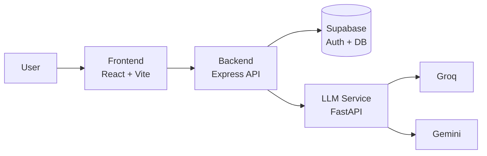

# 🌍 WanderAI

AI travel assistant with a clean 3-service architecture: **Frontend (React)**, **Backend (Node/Express)**, and **LLM Service (FastAPI + modular pipeline)**.

---

## ✨ Why this project is useful

WanderAI is built for practical travel planning, not just chat replies.

- Discover places by category, trends, and distance
- Open rich place pages (crowd timeline, nearby food/stay, teams, similar places)
- Ask natural language travel queries in chat
- Get AI recommendations + structured itinerary output
- Save session history and suggestions per logged-in user

---

## 🧱 Architecture



### Ports (recommended for local dev)

| Service     |   Port | Why                                  |
| ----------- | -----: | ------------------------------------ |
| Frontend    | `5173` | Vite dev server                      |
| Backend     | `5000` | Matches frontend API client base URL |
| LLM Service | `8000` | Used by backend `/api/chat` flow     |

---

## 📁 Essential Folder Structure

Only core files and directories are shown below.

```text
AMD/
├─ README.md
├─ frontend/
│  ├─ package.json
│  ├─ vite.config.js
│  └─ src/
│     ├─ App.jsx
│     ├─ main.jsx
│     ├─ components/
│     ├─ pages/
│     ├─ context/
│     └─ services/
│        ├─ api.js
│        └─ authService.js
│
├─ backend/
│  ├─ package.json
│  ├─ seed.js
│  └─ src/
│     ├─ server.js
│     ├─ routes/
│     │  ├─ authRoutes.js
│     │  ├─ locationRoutes.js
│     │  ├─ placesRoutes.js
│     │  ├─ userRoutes.js
│     │  ├─ chatRoutes.js
│     │  └─ sessionRoutes.js
│     ├─ controllers/
│     ├─ middleware/
│     ├─ services/
│     └─ store/
│
└─ LLM/
   ├─ requirements.txt
   ├─ server.py
   ├─ api_adapter.py
   ├─ config.py
   ├─ response_validation.py
   ├─ knowledge_base/
   ├─ modules/
   ├─ utils/
   └─ tests/
```

---

## 🔍 Service Responsibilities

### Frontend

- UI for auth, discovery, details, and chat
- Reads/writes token from local storage
- Calls backend through `src/services/api.js` and `src/services/authService.js`

### Backend

- Main API layer for frontend
- Validates Supabase JWT through middleware
- Handles places/location/user/session routes
- For chat: forwards message to LLM service, stores conversation history, returns structured result

### LLM Service

- Main endpoint: `POST /v1/chat`
- Health endpoint: `GET /v1/health`
- Optional KB update endpoint: `POST /v1/webhook`
- Uses modular engine (`m0` to `m3`) + grounding/validation before response

---

## 🚀 Run Locally (end-to-end)

### 1) Start LLM Service

```bash
cd SegFault_LLM_Modules
pip install -r requirements.txt
```

Create `.env`:

```env
GROQ_API_KEY=your_key
GEMINI_API_KEY=your_key
PRIMARY_LLM=groq
API_PORT=8000
```

Run:

```bash
python server.py
```

### 2) Start Backend

```bash
cd amd-backend
npm install
```

Create `.env`:

```env
PORT=5000
SUPABASE_URL=your_supabase_url
SUPABASE_SERVICE_ROLE_KEY=your_service_role_key
SUPABASE_ANON_KEY=your_anon_key
WANDERAI_BACKEND_URL=http://localhost:8000
```

Run:

```bash
npm run dev
```

### 3) Start Frontend

```bash
cd amd-frontend
npm install
npm run dev
```

Open `http://localhost:5173`.

---

## 🔌 Key Backend APIs

### Auth

- `POST /auth/signup`
- `POST /auth/login`
- `POST /auth/logout`
- `POST /auth/refresh`
- `GET /auth/me`

### Places & Location

- `GET /api/location`
- `GET /api/places`
- `GET /api/places/trending`
- `GET /api/places/:id`
- `GET /api/places/:id/crowd-timeline`
- `GET /api/places/:id/nearby`
- `GET /api/places/:id/teams`
- `GET /api/places/:id/similar`
- `GET /api/places/:id/itinerary`

### User, Chat, Sessions

- `GET /api/user/profile`
- `GET /api/user/history`
- `GET /api/user/recommendations`
- `GET /api/user/similar-users/places`
- `GET /api/chat/health`
- `POST /api/chat`
- `GET /api/sessions`
- `PUT /api/sessions/:id/title`
- `DELETE /api/sessions/:id`

---

## 🧪 Useful Commands

### Frontend

- `npm run dev`
- `npm run build`
- `npm run lint`

### Backend

- `npm run dev`
- `npm start`
- `npm run seed`

### LLM Service

- `python run.py`
- `python chatbot.py`
- `pytest -q`

---

## ✅ Quick Health Checklist

- Backend health: `GET http://localhost:5000/health`
- Backend ↔ Supabase: `GET http://localhost:5000/health/supabase`
- LLM Service health: `GET http://localhost:8000/v1/health`

If chat fails, first verify backend env `WANDERAI_BACKEND_URL=http://localhost:8000`.
