# WanderAI Integration Guide

Complete guide for integrating the WanderAI LLM-based travel planning engine with the Node.js backend.

## Overview

**WanderAI** is a modular LLM-based journey planning engine that converts natural-language requests into validated, actionable itineraries. It uses:

- **Module Pipeline**: Specialized modules (M0, M1, M2, M3) that run only when needed
- **RAG-based Grounding**: Knowledge base validation to ensure recommendations are supported
- **Structured Outputs**: Pydantic models for type-safe responses
- **Conservative Generation**: Redacts unsupported claims before returning to frontend

---

## Architecture

### WanderAI Backend (FastAPI on port 8000)

The WanderAI service provides three main HTTP endpoints:

#### 1. **POST /v1/chat** - Main Chat Endpoint

Send user messages and receive AI-powered travel recommendations.

**Request:**

```json
{
  "message": "Plan a trek similar to Rajmachi but somewhere new this weekend",
  "session_id": "optional-uuid-for-context",
  "user_id": "optional-user-identifier"
}
```

**Response:**

```json
{
  "response": "I'd recommend checking out Harishchandragad...",
  "session_id": "uuid-if-not-provided",
  "module_used": "m2_destination_suggester",
  "data": {
    "destinations": [
      {
        "name": "Harishchandragad",
        "distance": 130,
        "duration": 2.5,
        "difficulty": "moderate",
        "crowd_level": "low"
      }
    ],
    "itinerary": [...]
  }
}
```

**Response Fields:**

- `response` - Pretty formatted answer with emojis and markdown
- `session_id` - Session identifier for conversation context
- `module_used` - Which WanderAI module processed this (m1/m2/m3)
- `data` - Structured JSON with destinations, itinerary, etc.

#### 2. **GET /v1/health** - Health Check

Check if WanderAI service is running.

**Response:**

```json
{
  "status": "ok",
  "timestamp": "2026-02-26T15:30:00Z",
  "modules": {
    "m1_intent_extractor": "ready",
    "m2_destination_suggester": "ready",
    "m3_itinerary_builder": "ready"
  }
}
```

#### 3. **POST /v1/webhook** - Knowledge Base Updates

Update the local knowledge base without restarting.

**Request:**

```json
{
  "action": "add",
  "type": "destination",
  "data": {
    "name": "New Trekking Spot",
    "location": "Western Ghats",
    "difficulty": "moderate"
  }
}
```

---

## Backend Integration

### Node.js Backend (Express on port 5000)

The Node backend acts as a bridge between the frontend and WanderAI:

```
Frontend → Node Backend (/api/chat) → WanderAI Backend (/v1/chat) → LLM
    ↓                           ↓                                    ↓
   Chat UI              Auth + Session Mgmt        Modular Processing + RAG
                        + Database Persistence
```

### Chat Flow

```mermaid
graph LR
    U["👤 User<br/>(Frontend)"]
    NB["🟢 Node Backend<br/>Port 5000"]
    WA["🟡 WanderAI<br/>Port 8000"]
    DB["🟣 Supabase<br/>Database"]

    U -->|POST /api/chat| NB
    NB -->|Auth + Session| DB
    NB -->|POST /v1/chat| WA
    WA -->|LLM Response| NB
    NB -->|Save History| DB
    NB -->|JSON Response| U
```



---

## Chat Endpoint Reference

### Node Backend: POST /api/chat

**Endpoint:** `POST /api/chat`

**Authentication:** Required (Bearer token)

**Request Body:**

```json
{
  "message": "Plan a weekend trek",
  "sessionId": "optional-uuid"
}
```

**Request Fields:**

- `message` (required) - User's natural language request
- `sessionId` (optional) - For continuing previous conversations

**Response (200):**

```json
{
  "ok": true,
  "sessionId": "550e8400-e29b-41d4-a716-446655440000",
  "response": "📍 I'd recommend Harishchandragad (⛰️ Trek, 2.5h from Pune)...",
  "data": {
    "destinations": [...],
    "itinerary": [...],
    "crowd_level": "low"
  },
  "module_used": "m2_destination_suggester",
  "suggested_places": ["Harishchandragad", "Kalsubai Peak", ...]
}
```

**Response Fields:**

- `ok` (boolean) - Success indicator
- `sessionId` (string) - Session UUID for conversation continuity
- `response` (string) - Pretty formatted response with emojis
- `data` (object) - Structured JSON with destinations, itinerary, etc.
- `module_used` (string) - Which WanderAI module handled this
- `suggested_places` (array) - All places suggested in this session

**Error Response (500):**

```json
{
  "ok": false,
  "error": "CHAT_ERROR",
  "message": "WanderAI backend error: 500"
}
```

---

## Frontend Integration

### JavaScript/Fetch Example

```javascript
// Send chat message
async function sendMessage(message, sessionId = null) {
  const accessToken = localStorage.getItem("access_token");

  const response = await fetch("http://localhost:5000/api/chat", {
    method: "POST",
    headers: {
      Authorization: `Bearer ${accessToken}`,
      "Content-Type": "application/json",
    },
    body: JSON.stringify({
      message,
      sessionId,
    }),
  });

  const data = await response.json();

  if (data.ok) {
    return {
      response: data.response,
      sessionId: data.sessionId,
      destinations: data.data.destinations,
      itinerary: data.data.itinerary,
    };
  } else {
    throw new Error(data.message);
  }
}

// Usage
const result = await sendMessage("Plan a trek for this weekend");
console.log(result.response);
console.log(result.destinations);
```

### React Component Example

```javascript
import { useState } from "react";
import { useAuth } from "../hooks/useAuth";

export function ChatWidget() {
  const [messages, setMessages] = useState([]);
  const [input, setInput] = useState("");
  const [sessionId, setSessionId] = useState(null);
  const [loading, setLoading] = useState(false);
  const accessToken = localStorage.getItem("access_token");

  const handleSendMessage = async (e) => {
    e.preventDefault();
    if (!input.trim()) return;

    setLoading(true);
    try {
      const response = await fetch("http://localhost:5000/api/chat", {
        method: "POST",
        headers: {
          Authorization: `Bearer ${accessToken}`,
          "Content-Type": "application/json",
        },
        body: JSON.stringify({
          message: input,
          sessionId,
        }),
      });

      const data = await response.json();

      if (data.ok) {
        // Add user message
        setMessages((prev) => [
          ...prev,
          {
            role: "user",
            content: input,
          },
        ]);

        // Add bot response
        setMessages((prev) => [
          ...prev,
          {
            role: "assistant",
            content: data.response,
            data: data.data,
          },
        ]);

        // Set session for future messages
        setSessionId(data.sessionId);
        setInput("");
      }
    } catch (error) {
      console.error("Error:", error);
    } finally {
      setLoading(false);
    }
  };

  return (
    <div className="chat-widget">
      <div className="messages">
        {messages.map((msg, idx) => (
          <div key={idx} className={`message ${msg.role}`}>
            <p>{msg.content}</p>
            {msg.data?.destinations && (
              <div className="destinations">
                {msg.data.destinations.map((dest) => (
                  <div key={dest.name} className="destination-card">
                    <h4>{dest.name}</h4>
                    <p>Distance: {dest.distance}km</p>
                    <p>Duration: {dest.duration}h</p>
                  </div>
                ))}
              </div>
            )}
          </div>
        ))}
      </div>

      <form onSubmit={handleSendMessage}>
        <input
          value={input}
          onChange={(e) => setInput(e.target.value)}
          placeholder="Ask about travel recommendations..."
          disabled={loading}
        />
        <button type="submit" disabled={loading}>
          {loading ? "Thinking..." : "Send"}
        </button>
      </form>
    </div>
  );
}
```

---

## Session Management

### How Sessions Work

1. **First Message**: Frontend doesn't provide `sessionId`
   - Node backend generates UUID
   - Creates new session in Supabase
   - Returns `sessionId` to frontend

2. **Follow-up Messages**: Frontend sends previous `sessionId`
   - WanderAI uses conversation history for context
   - More accurate recommendations based on prior requests
   - Session persisted in database

3. **Session Storage** (Supabase)
   ```sql
   {
     "id": "uuid",
     "user_id": "user-uuid",
     "title": "Trek Planning Session",
     "history": [
       {"role": "user", "content": "Plan a trek"},
       {"role": "assistant", "content": "I recommend..."}
     ],
     "suggested_places": ["Harishchandragad", "Kalsubai"],
     "data": { ... },
     "created_at": "2026-02-26T10:00:00Z",
     "updated_at": "2026-02-26T15:30:00Z"
   }
   ```

---

## WanderAI Modules

The WanderAI pipeline has 4 modules that run in sequence:

### M0: Query Refiner

- Cleans and normalizes user input
- Extracts temporal constraints (weekend, next month, etc.)
- Handles typos and implicit intents

### M1: Intent Extractor

- Determines what user is asking
- Types: `destination_suggest`, `itinerary_create`, `crowd_check`, etc.
- Extracts constraints: budget, duration, difficulty

### M2: Destination Suggester

- Uses RAG to find matching places
- Considers user preferences and history
- Returns validated destinations with scores

### M3: Itinerary Builder

- Converts suggestions into day-by-day plans
- Includes timing, logistics, cost estimates
- Provides citations for knowledge base

**Module Dispatch Example:**

```
"Plan a trek" → M1 (Intent: destination_suggest) → M2 (Find treks)
"Create a 3-day itinerary" → M1 → M3 (Build detailed plan)
"How crowded is Rajmachi?" → M1 → Custom crowd check
```

---

## Error Handling

### WanderAI Service Down (500)

```javascript
try {
  const response = await sendMessage(userInput, sessionId);
} catch (error) {
  if (error.message.includes("WanderAI")) {
    // Show: "Travel assistant is temporarily offline"
    showErrorMessage("Unable to connect to travel planner");
  }
}
```

### No Valid Destinations (200 but empty data)

```javascript
if (data.data.destinations?.length === 0) {
  // Handle gracefully
  showMessage(
    "I couldn't find recommendations matching that description. Try adjusting your preferences.",
  );
}
```

---

## Environment Setup

### Required Environment Variables

```env
# .env file
WANDERAI_BACKEND_URL=http://localhost:8000
SUPABASE_URL=https://your-project.supabase.co
SUPABASE_SERVICE_ROLE_KEY=your-key
```

### Starting Services

**Terminal 1 - WanderAI Service:**

```bash
cd wanderai_llm_modules
python server.py
# or: uvicorn server:app --host 0.0.0.0 --port 8000
```

**Terminal 2 - Node Backend:**

```bash
cd amd-backend
npm run dev
# Runs on http://localhost:5000
```

### Verify Connection

```bash
# Check WanderAI health
curl http://localhost:8000/v1/health

# Check Node backend
curl http://localhost:5000/health

# Test chat (requires auth token)
curl -X POST http://localhost:5000/api/chat \
  -H "Authorization: Bearer YOUR_TOKEN" \
  -H "Content-Type: application/json" \
  -d '{"message": "Plan a trek"}'
```

---

## Monitoring & Debugging

### Enable Request Logging

The Node backend logs all WanderAI requests:

```
📤 Calling WanderAI at: http://localhost:8000/v1/chat
📝 Payload: {"message": "Plan a weekend trek", ...}
📥 WanderAI response: {"response": "I'd recommend...", ...}
```

### Common Issues

| Issue                       | Solution                                                 |
| --------------------------- | -------------------------------------------------------- |
| `ECONNREFUSED` on port 8000 | Start WanderAI service on port 8000                      |
| Empty `data` object         | WanderAI couldn't find matches; try different keywords   |
| Slow responses              | Large knowledge base; WanderAI doing RAG queries         |
| Different responses         | LLM may generate varied text; use `data` field for logic |

---

## Performance Tips

- **Batch Requests**: Load multiple sessions in parallel
- **Session Reuse**: Send `sessionId` for context rather than re-explaining
- **Cache Destinations**: Store returned destinations client-side
- **Stream Responses**: For long itineraries, implement server-sent events (SSE)

---

## Future Enhancements

- [ ] Vector embeddings for better RAG (FAISS/Chroma)
- [ ] Multi-turn conversation with memory
- [ ] Real-time crowd predictions integration
- [ ] Weather-aware recommendations
- [ ] Cost estimation with booking integration
- [ ] Group travel planning features

---

## Documentation Links

- [WanderAI Backend Docs](../wanderai_llm_modules/DOCUMENTATION.md)
- [WanderAI Backend Integration](../wanderai_llm_modules/BACKEND_INTEGRATION.md)
- [Session Management](SESSION_ENDPOINTS.md)
- [Auth Integration](AUTH_INTEGRATION.md)

---

## Support

For issues or questions:

1. Check `DOCUMENTATION.md` in WanderAI repo
2. Review logs in both backends
3. Test endpoints individually with cURL
4. Check environment variables are set correctly
